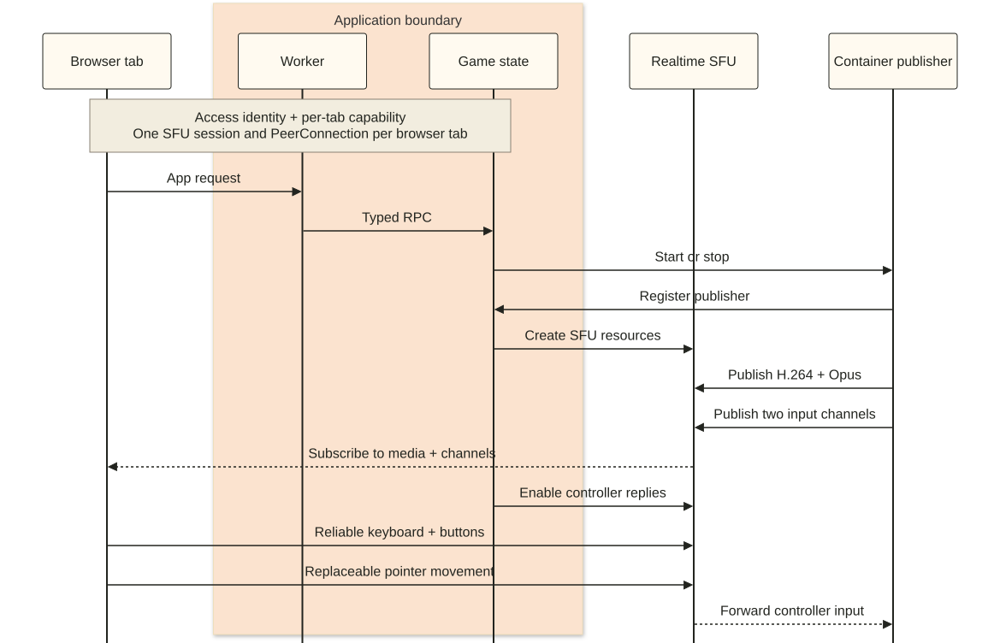

# Cloud gaming with Realtime SFU

> Example status: **Experimental**

Run Freedoom in a Cloudflare Container, stream its video and audio through
Realtime SFU, and send keyboard and mouse input back over DataChannels.

The blueprint has one game slot, any number of admitted viewers up to its
configured limit, and one controlling browser tab.

## Requirements

- Node.js 22.12 or later.
- Docker or another compatible local container engine.
- A Cloudflare account on the Workers Paid plan with Containers available.
- A Realtime SFU application ID and bearer token.
- Cloudflare Access for a deployed instance.

## Run locally

Install dependencies and create the ignored local configuration:

```bash
npm ci
cp .dev.vars.example .dev.vars
```

Set `REALTIME_SFU_APP_ID` and `REALTIME_SFU_BEARER_TOKEN` in `.dev.vars`, then
start the application:

```bash
npm run dev
```

Open `http://localhost:8787/`. Local identity works only on loopback hosts, and
the Realtime SFU credentials remain in the Worker.

## Try it

1. Select **Start** and wait for the status to become **Running**. Container
   acquisition may take up to ten minutes; the publisher then has two minutes
   to become ready.
2. Open the page in a second tab. Both tabs should receive video and audio.
3. Select **Take control** in either tab, wait for control to become ready, and
   click the game to capture the pointer.
4. Use the keyboard and mouse. **Send Esc** opens the Freedoom menu; physical
   `Escape` releases browser pointer lock.
5. Confirm the other tab remains view-only, then select **Release control** or
   **Stop game**.

Multiple tabs may use the same identity. A per-tab viewer capability ensures
that only the tab holding control can send input.

## How it works



The Container captures Freedoom as H.264 video and Opus audio and publishes
both tracks to Realtime SFU. Each browser tab uses one SFU session and one
PeerConnection to receive media and carry its input DataChannels.

The publisher creates two input channels:

- Keyboard, button, wheel, and reset input is reliable and ordered.
- Pointer movement is unordered with `maxRetransmits: 0` because newer movement
  replaces older movement.

Viewers subscribe with `waitForAck: true` and initially have
`canReply: false`. Taking control updates the existing subscriptions to allow
replies. The browser sends input only after the publisher confirms the current
viewer and controller generation.

The Worker verifies identity, owns authorization and lifecycle state, and keeps
Realtime SFU credentials out of the browser. See
[`ARCHITECTURE.md`](ARCHITECTURE.md) for signaling, reconnect, cleanup, and
multi-slot adaptation.

## Deploy

Set the Realtime SFU values in the ignored `.dev.vars` file described above.
Create a Cloudflare Access application for the Worker hostname, then export its
team domain and audience:

```bash
export CF_ACCESS_TEAM_DOMAIN='<team-name>.cloudflareaccess.com'
export CF_ACCESS_AUD='<access-application-audience>'
```

Deploy with the SFU values installed as Worker secrets and the Access values as
Worker variables:

```bash
npm run deploy -- \
  --secrets-file .dev.vars \
  --var "CF_ACCESS_TEAM_DOMAIN:${CF_ACCESS_TEAM_DOMAIN}" \
  --var "CF_ACCESS_AUD:${CF_ACCESS_AUD}"
```

Confirm the application hostname is protected by the matching Access policy
before inviting users. Wrangler builds the Dockerfile and stores the private
image in your account; this repository does not publish a prebuilt image. See
[`PRODUCTION.md`](PRODUCTION.md) for authorization and deployment boundaries,
and
[`THIRD_PARTY_NOTICES.md`](THIRD_PARTY_NOTICES.md) for licenses and source
provenance.

## Clean up

Select **Stop game** and wait for the status to become **Offline** before
deleting the Worker. The application stops the Container and closes known
Realtime SFU tracks and DataChannels in the background.

```bash
npx wrangler delete
```

Remove the Access application separately. Repeated stop and cleanup requests
are safe.

## Checks

```bash
npm run check
```

This checks Worker types, TypeScript, focused runtime behavior, the production
build, and generated browser assets. Deployment builds the Linux publisher
image; media and input require browser validation.

## Known limitations

- The blueprint runs one fixed Freedoom slot and one active controller.
- Control requires a desktop browser with keyboard and pointer-lock support.
- A failed media pipeline ends the run rather than restarting transparently.
- Access policy, rate limiting, and admission limits remain deployment
  responsibilities.
- Access applications and policies are configured separately from Wrangler.

See [`TROUBLESHOOTING.md`](TROUBLESHOOTING.md) for symptom-based checks.
