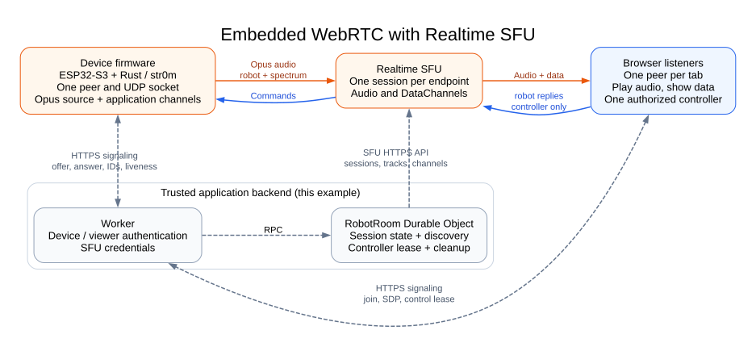

# Embedded WebRTC architecture

The firmware and each browser own a WebRTC connection to Realtime SFU.
A separate Worker and Durable Object handle authentication and application
signaling. The [firmware walkthrough](firmware/docs/sfu.md) follows the API
sequence; this guide covers the application around it.

The [editable Graphviz source](docs/architecture.dot) renders with
`dot -Tsvg docs/architecture.dot -o docs/architecture.svg` from `esp32-radio/`.
Solid arrows carry WebRTC; dashed arrows show this example's HTTPS signaling.

## Firmware and server boundaries

| Component | Owns |
| --- | --- |
| Firmware | Peer, UDP socket, media clock, playback and device I/O; separate tasks for HTTPS signaling, analysis and metrics |
| Worker and `RobotRoom` | Authentication, SFU API calls, discovery, controller lease and cleanup |
| Browser `RadioSession` | Listener peer, playback, DataChannels, timers and teardown |

The [stack map](firmware/docs/sfu.md#read-the-stack-from-the-peer-outward) and
[signaling boundary](firmware/docs/sfu.md#replace-device-to-server-signaling)
identify the code to adapt when replacing the device platform or backend.

## Media and data direction

One board publishes one `music` audio track. Firmware reads pre-encoded stereo
Opus from flash and supplies frames to str0m; the browser decodes and plays them.
The board does not capture a microphone or drive a speaker. Audio, telemetry,
spectrum, and controller replies traverse the SFU. The Worker handles signaling
and state, not those WebRTC payloads.

| Channel | Direction | Profile and application purpose |
| --- | --- | --- |
| `robot` | Board to listeners; authorized controller replies to board | Ordered, reliable JSON telemetry, metadata, commands and command acknowledgments |
| `spectrum` | Board to listeners | Unordered, zero retransmits; binary frequency-band samples |
| `server-events` | SFU transport bootstrap/events | Reserved stream 0, separate from application channels |

The [listener setup](firmware/docs/sfu.md#a-listener-and-the-return-path)
explains channel allocation, acknowledgments, and controller replies. Local
volume/mute never changes the board's shared playback.

## Authentication

The ignored `.credential.env` is the local provisioning source. The deploy
helper sends four secrets to the Worker: `REALTIME_APP_ID`, `REALTIME_APP_TOKEN`,
`DEVICE_TOKEN`, and `VIEWER_PASSWORD`. Generated `worker/.dev.vars` and Worker
build output may contain these secrets; only `worker/dist/client/` is public.

The device receives its own bearer token, Wi-Fi credentials, and signaling URL
in private build configuration. It does not receive the SFU app token or viewer
password. Device firmware and backups therefore also need private storage.

Viewer login signs a 24-hour, HttpOnly, SameSite=Strict cookie using the shared
viewer password. Over HTTPS the cookie is Secure. Existing viewer operations
also require that viewer's token. A local Worker bypasses viewer authentication
only for loopback hostnames; the explicit live development proxy still reaches
the deployed Worker's authentication. Static exhibit assets are public.

Authentication lives in [auth.ts](worker/src/server/auth.ts) and the middleware
in [index.ts](worker/src/server/index.ts). Mutations enforce origin checks and
bounded JSON input. See [identity integration](PRODUCTION.md#authentication-and-authorization)
when replacing the shared password.

## Authorization

`RobotRoom` maps the configured `ROBOT_NAME` to one Durable Object. That label
selects application state; it is not a hardware identity or credential. The
device bearer token authorizes publisher creation/replacement. A viewer cookie
authorizes joining, and the returned viewer token owns subsequent operations.

This example allows up to eight listeners per board. Realtime SFU does not
impose a subscriber-count limit. The admission check is application policy in
[`RobotRoom.joinViewer()`](worker/src/server/robot-room.ts), before it requests
an SFU session.

Within the current publisher generation, one listener can control playback at
a time. Browsers send a heartbeat every five seconds; a controller's successful
heartbeat renews its unexpired lease for 15 seconds. Expiry or release revokes
SFU `canReply` permission before another viewer can take control. Failed
revocation remains pending for retry. Changing the UI alone does not grant
reply permission. Retiring the publisher uses the separate
[generation cleanup policy](#cleanup-and-failure-behavior) below.

## Signaling and identifiers

The radio task owns its offer/answer transition; its signaling task exchanges
SDP with the backend through typed requests. The browser establishes
DataChannels before subscribing to `music`. The
[walkthrough](firmware/docs/sfu.md#publisher-setup) maps each step to source.

`RobotRoom` serializes operations across awaits and persists state under `room`.
Browser setup is sequential; cancellation invalidates its epoch so a late
response cannot revive a stopped connection. Keep each endpoint's SDP changes
in order, including applying an immediate renegotiation answer before another
mutation. This application has a fixed topology, not a generic renegotiation SDK.

| Identifier | Owner and purpose |
| --- | --- |
| SFU session ID, channel IDs and track mids | SFU allocations retained by the backend for use and cleanup within the current generation |
| Publisher `bootId` | Firmware retry identity; the same ID must retain the same offer and startup metadata |
| Publisher generation | Backend-issued identity required by device operations after startup and viewer memberships |
| Viewer ID and token | Backend-created membership and its secret ownership proof |
| Playback revision | Device occurrence of a song within a generation; rejects stale metadata/spectrum |

Session IDs, names, mids, generations, and URLs are locators, not credentials.
SDP contains temporary transport credentials and must not be logged.

## Reconnect

Firmware retries permitted setup failures with the same request body. Fatal
transport/signaling failures trigger one board restart with backoff; the next
boot replaces the publisher generation using the cleanup policy below. The
radio task owns the peer and socket throughout; HTTPS runs on its own task.

A temporary browser `disconnected` state waits for WebRTC to recover. Failed
connections, closed channels, expired membership, or a changed/offline publisher
close the listener. Once the board is online, the user selects **Start listening**
again. Browser refresh creates a new viewer; there is no automatic rejoin or
ICE-restart implementation. A compatible Worker restart loads persisted state.

## Cleanup and failure behavior

**Disconnect** closes local peer/audio state and attempts the owned leave API;
page departure also sends a best-effort leave beacon. Repeating local teardown
is safe. A repeated leave after its record is gone may return 403; it cannot
recreate resources. Unreachable leave requests fall back to inactivity cleanup.

Alarms preserve the earliest scheduled check when status is polled. While the
publisher generation remains current, they revoke expired controller leases and
retry cleanup for closing viewers or viewers inactive for more than 45 seconds.
Successful track/channel allocations returned beside an error are persisted as
cleanup receipts before validation fails. Failed cleanup keeps those IDs for
retry. The client accepts a per-item `close_track_error` identifying a requested
resource on a successful close response as absence of that item. Request-level
errors, including HTTP 404/410, remain unresolved; they do not prove all requested
resources are closed or a controller's permission is revoked.

A new boot retires the old publisher, viewers, controller state, and cleanup
receipts before allocating its session. Retirement is persisted even if new
allocation fails. Alarms do the same after more than 90 seconds without a device
heartbeat; status shows the publisher offline after 25 seconds. Neither path
contacts obsolete SFU sessions or retries their cleanup. Replacement does not
depend on old cleanup succeeding. Alarms run at 10-second intervals; these
application thresholds are not SFU expiry guarantees.

Generation checks reject stale device operations after startup and old viewer
memberships. Retirement does not establish that old SFU forwarding or reply
access has stopped. Browsers
close their old peer when status changes or membership is rejected, and a board
restart closes its old transport. Endpoints that remain connected may still
exchange media or replies until they close or the SFU expires the relevant
resources. An adaptation requiring enforced revocation must retain enough
resource state to confirm closure or permission removal before discarding it.
This example does not audit SFU expiration or account-wide cleanup; follow
[operations](PRODUCTION.md#stop-and-clean-up) when removing the deployment.

## Current scope

See the [known limitations](README.md#known-limitations) for the supported
board, networking, and validation scope, and the
[adaptation guide](firmware/docs/sfu.md#adapt-to-another-soc-or-design) for
platform responsibilities to replace and validate.
