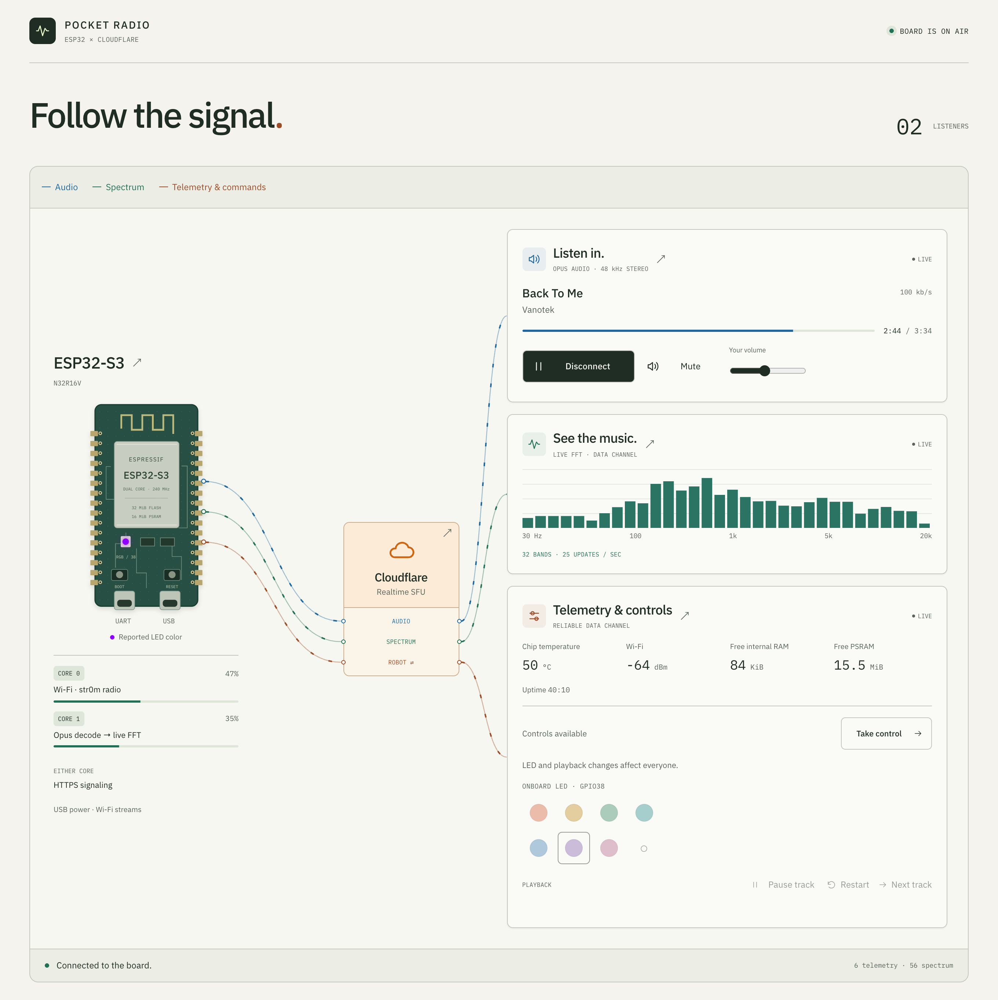

# Embedded WebRTC with Realtime SFU: Pocket Radio

Example status: **Experimental**.

This example shows how embedded firmware connects to Cloudflare Realtime SFU:
negotiate a WebRTC session, publish audio and telemetry, and receive control
commands over DataChannels. Pocket Radio is the working ESP32-S3 implementation,
with a browser for listening and device control.

- **Understand and adapt:** follow the [firmware/SFU walkthrough](firmware/docs/sfu.md)
  through the protocol sequence and the code that owns each step.
- **Run Pocket Radio:** use the [setup below](#set-up) to stream a playlist,
  view live spectrum and telemetry, and control playback and the board's LED.

[](docs/pocket-radio.png)

*Pocket Radio receiving audio, spectrum, and telemetry through Realtime SFU.*

The [architecture](ARCHITECTURE.md) explains the device, browser, Worker, and
Durable Object boundaries. Audio and DataChannels travel through the SFU;
the Worker keeps SFU credentials and handles application signaling.

## Set up

You need:

- **ESP32-S3-DevKitC-1 N32R16V**, with 32 MiB octal flash, 16 MiB octal PSRAM,
  and an RGB LED on GPIO38. Use its native USB port and a Wi-Fi network that
  allows outbound IPv4 UDP and HTTPS.
- **Linux x86_64**, Node 24, Python 3.11 with venv support, Rust 1.88 or later
  with rustup/rustfmt/Clippy, and the
  [ESP-IDF prerequisites](https://docs.espressif.com/projects/esp-idf/en/v5.5.3/esp32s3/get-started/linux-macos-setup.html#step-1-install-prerequisites).
  Install `ffmpeg` and `ffprobe` to prepare your own audio.
- **A Cloudflare account** with Realtime SFU, Workers, SQLite-backed Durable
  Objects, and an active zone for a custom domain.

Create a [Cloudflare Realtime SFU app](https://developers.cloudflare.com/realtime/sfu/get-started/)
and obtain its App ID and App Secret. From a clean checkout:

```sh
git clone https://github.com/cloudflare/realtime-examples.git
cd realtime-examples/esp32-radio
make setup
cp .credential.env.example .credential.env
# Fill in REALTIME_APP_ID, REALTIME_APP_TOKEN (the App Secret),
# WIFI_SSID, and WIFI_PASSWORD.
make secrets
```

All `make` commands below run from `realtime-examples/esp32-radio/`.
`make secrets` generates the device token and viewer password when missing.
The SFU app values stay on the Worker; firmware receives only device and Wi-Fi
credentials plus the signaling URL.

In [worker/wrangler.jsonc](worker/wrangler.jsonc), replace `radio.example.com`
in `routes` with your hostname, retaining `custom_domain: true`. Keep the Worker
name `esp32-radio`, which the deployment helper uses for its generated path.
Authenticate, select your account, and deploy:

```sh
(cd worker && ./node_modules/.bin/wrangler login)
export CLOUDFLARE_ACCOUNT_ID=your-account-id
export SIGNALING_URL=https://radio.example.com
make deploy-dry-run
make deploy
```

Replace both placeholders. `SIGNALING_URL` must match the configured hostname;
keep it exported for firmware builds and live previews. The helper builds and
checks the web app and uploads its four secrets from ignored `.credential.env`.
Only `worker/dist/client/` is public output. Keep `.dev.vars`, other Worker
build output, firmware images, and flash backups private.

## Back up and flash

Your account needs serial-device access, commonly membership in `dialout` on
Debian/Ubuntu. Start a new login session after changing group membership.
Set `ESP32_PORT` if more than one board is connected.

Put audio you have permission to use in ignored `tracks/`. Backup and flash
reset the board and interrupt any current listeners. Save a verified backup
before replacing its software:

```sh
make backup
make music TRACK=tracks/
make build-firmware
make flash FLASH_ARGS=
make monitor
```

Backups stay in `artifacts/hardware-validation/`; flash helpers require a valid
saved backup. `FLASH_ARGS=` writes both firmware and music for the first run.
Plain `make flash` preserves existing music. Stop the monitor with Ctrl-C; see
[backup and flash details](firmware/README.md#backup-and-flash-details) for
multiple boards, cached writes, and reset checks.

## Listen and control

Open your Worker URL, enter `VIEWER_PASSWORD` from `.credential.env`, and select
**Start listening**. Audio plays in the browser; the board needs only USB power.
If autoplay is blocked, select **Enable sound**.

Open a second tab or browser at the same URL and start listening there too.
Each tab owns its own SFU session. Select **Take control** in one tab, change
the LED or pause playback, and observe the shared change in both tabs. The
other tab keeps listening but cannot take control until the controller selects
**Release control**, disconnects, or its lease is revoked after expiry.
Volume and mute affect only their browser.

Select **Disconnect** to leave. After a board restart or expired session,
select **Start listening** again once the board is online. See
[reconnect behavior](ARCHITECTURE.md#reconnect) and the
[hardware smoke test](worker/README.md#browser-tests).

## Change the playlist

Put audio files in ignored `tracks/`, then prepare them in filename order:

```sh
make music TRACK=tracks/
make flash-music
```

This reboots the board; reconnect listeners afterward. No Worker deployment is
needed. See [playlist options and limits](firmware/docs/music.md#prepare-a-playlist)
for custom order and metadata, and [compatibility](ERRATA.md#music-pack-compatibility)
before flashing a board with an older partition layout.

## Development

Use the [firmware guide](firmware/README.md) for device builds and the
[Worker guide](worker/README.md) for local browser/backend development.
`make fmt` formats Rust, C, and web source.

Repository CI uses Node 24 and Rust 1.88.0. From the examples repository root,
run the declared suite once through the blueprint runner:

```sh
npm ci
npm run check
node scripts/run-blueprint-checks.mjs esp32-radio
```

The [declared suite](blueprint.yaml) installs its host tools and checks portable
firmware, vendor patches, web code, host helpers, and Worker lifecycle/builds,
including the browser credential scan. It needs no hardware or real credentials.
Firmware and live checks apply when changing device behavior; see the component
guides. Use [troubleshooting](TROUBLESHOOTING.md) when a step fails.

## Stop and clean up

Select **Release control** and **Disconnect** in open listeners. Power off your
board to stop publication. Keep the Worker available while its alarms expire
inactive sessions and retry SFU cleanup. Stop local dev servers with Ctrl-C.
The [operations guide](PRODUCTION.md#stop-and-clean-up) covers cleanup timing,
failure handling, and removing your Worker, domain, and dedicated SFU app.

## Known limitations

- Firmware targets the ESP32-S3-DevKitC-1 N32R16V and the pinned Linux x86_64
  build tools. Other boards, microphone input, and device speaker output are
  not implemented.
- Outbound IPv4 UDP is required. There is no TURN relay or TCP fallback.
- The Worker's [listener policy](ARCHITECTURE.md#authorization) caps this example
  at eight listeners per board, with one controller.
- Browsers reconnect manually after a board restart or terminal connection
  failure. A temporary disconnected WebRTC connection may recover in place.
- The shared password is a small application authentication seam. Per-user
  identity, login throttling, and deployment abuse controls are integration work.
- Hardware, Wi-Fi, and live SFU behavior require device tests. Host CI covers
  portable code and simulated SFU lifecycle behavior, including cleanup retries.
- A hosted demo is not included; use your own deployment.

See [source and licensing](UPSTREAM.md) for provenance and
[third-party notices](THIRD_PARTY.md) for dependencies.
