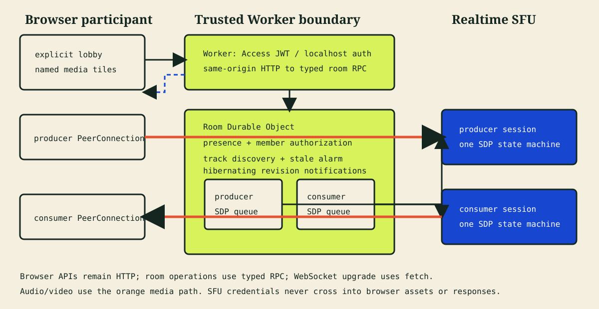

# Architecture



The editable diagram source is [architecture.mmd](architecture.mmd). Regenerate
the SVG with:

```sh
npm run diagram
```

This is the canonical Realtime composition for one Durable Object per room plus
WebSocket Hibernation. The Durable Object owns state and coordination, uses
`acceptWebSocket()` with bounded serialized participant attachments, and finds
sockets through `getWebSockets()`. Sockets carry revision notifications only;
the browser-facing API remains authoritative HTTP for snapshots, SDP,
authorization, mutations, and cleanup. Behind that API, the Worker uses typed
Durable Object RPC for ordinary room operations and `fetch()` only for the
WebSocket upgrade.

## Trust boundaries

The browser receives only application membership capabilities, short-lived
notification tickets, public room state, SDP, and media locators. The Realtime
SFU application ID and bearer token are Worker bindings and are used only by
the Durable Object's server-side SFU client.

Cloudflare Access JWT verification is the deployed authentication seam.
Localhost uses a separate explicit development identity path that rejects
non-local hosts. The browser creates a random join/member capability before its
first request and reuses it for identical retries; only its SHA-256 hash is
stored in the Durable Object.

Room names, participant IDs, SFU session IDs, track names, mids, and URLs are
locators rather than authorization.

The initial join sends the browser-generated member token in its validated JSON
body. Later authorized HTTP requests send it in the
`x-room-member-token` header. An authenticated endpoint exchanges it for a
random 30-second, single-use WebSocket ticket tied to that participant. The
ticket is consumed from `Sec-WebSocket-Protocol`, not a URL.

## Media direction

Each participant owns two independent browser/SFU session pairs:

- The producer `RTCPeerConnection` is send-only and publishes local audio and
  video to one Realtime SFU session.
- The consumer `RTCPeerConnection` is receive-only in practice and pulls all
  remote tracks through a second Realtime SFU session.

A single bidirectional `RTCPeerConnection` and Realtime SFU session can publish
and subscribe. This blueprint uses separate sessions so each media direction
and its negotiation queue are easier to inspect independently. An adaptation
that uses one session must serialize both publish and subscribe changes through
that session's shared offer/answer lifecycle.

## Signaling and state flow

1. The Worker authenticates the request, obtains the room's named Durable Object
   stub, and calls the operation's typed RPC method.
2. Join creates separate producer and consumer SFU sessions and stores a room
   membership record. The RPC method returns a tagged result that the Worker
   maps to the public HTTP response.
3. The browser creates a producer offer. The Durable Object calls
   `tracks/new` with server-held credentials and returns the SFU answer.
4. Published track names and kinds become Durable Object track-discovery
   state.
5. A browser opens a hibernating notification WebSocket. This upgrade is the
   only Worker-to-Durable Object path that uses `fetch()`. Socket open and
   `room-changed` revision messages trigger an authorized HTTP snapshot; a
   periodic 15-second HTTP poll provides a separate convergence check.
6. The browser submits the exact set of remote track keys it wants over HTTP.
7. The Durable Object maps those keys to producer session IDs and track names,
   then calls `tracks/new` on the participant's consumer session.
8. When the SFU returns an offer with
   `requiresImmediateRenegotiation=true`, the browser applies it, creates an
   answer, and sends that answer to the Durable Object's `/renegotiate`
   operation.

The Durable Object is the application source of truth for active membership,
display names, creator authority, published tracks, and consumer subscriptions.
The SFU is the media-session source of truth.

Expected validation, authorization, queue, and sanitized SFU failures become
plain `{ type: "error", error }` RPC results; successful operations return
`{ type: "ok", value }`. The Worker translates both into the existing HTTP
contract. Thrown RPC exceptions are reserved for unexpected runtime or
invariant failures. The Worker does not retry them or reuse that stub; a later
request obtains a fresh named stub.

## Notification WebSocket

The WebSocket is notification-only. Its complete server payload is:

```json
{"type":"room-changed","revision":12}
```

Snapshots, SDP, track locators, publication, subscription, renegotiation,
leave, termination, authorization, and mutation queues remain on the existing
browser-facing HTTP APIs. The Worker maps those requests to typed Durable Object
RPC; only this WebSocket upgrade uses the stub's `fetch()` method.

The Durable Object accepts sockets with
`DurableObjectState.acceptWebSocket()`. It stores only bounded
`{participantId}` metadata with `serializeAttachment()`, restores that metadata
with `deserializeAttachment()`, and broadcasts revisions by iterating
`getWebSockets()`. There is no in-memory socket registry, so connections remain
usable across hibernation.

Ticket hashes and expiry remain in Durable Object storage until consumed or
pruned. A ticket can open one socket only, and a newer socket replaces the
participant's previous notification socket using `getWebSockets()` attachment
matching. Client reconnect uses bounded exponential backoff, requests a new
ticket for each attempt, and immediately resyncs over HTTP after the socket
opens.

Socket close or error never removes room presence. Heartbeats and the existing
45-second stale cleanup remain authoritative.

## SDP serialization

Every producer and consumer SFU session has its own FIFO mutation queue.
An operation that returns an immediate SFU offer sends that offer to the
browser but keeps the queue locked. Later add, close, leave, or reconnect work
waits until the matching browser answer succeeds through the SFU
`/renegotiate` endpoint.

The browser also serializes every operation per `RTCPeerConnection`. A queued
subscription owns the full cycle from `setRemoteDescription` through
`setLocalDescription` and the server renegotiation acknowledgment. Retryable
requests reuse the same mutation ID and SDP phase; work arriving while
signaling is unstable remains queued rather than being discarded.

SFU retryability follows HTTP and application semantics rather than provider
error-code names. Network failures, request timeouts, HTTP 429, and HTTP 5xx
responses are retryable; ordinary HTTP 4xx responses are not. An error embedded
in an otherwise successful SFU response has no HTTP status, so the application
maps it to a generic retryable upstream failure. Provider error descriptions
are never returned to the browser.

Leave synchronously appends its cleanup operation and seals each queue, so
existing work and required renegotiation can finish but no later mutation can
enter behind cleanup. Forced cleanup invalidates new work, waits for the active
SFU request to settle, records any returned mids, then closes the complete mid
set. An active stale-generation result cannot publish presence or track state.

Join/reconnect/leave/stale/termination lifecycles are serialized per browser or
participant. Identical joins reuse the browser capability, identical reconnects
reuse a persisted request ID, and every publish/subscribe/renegotiate request is
rejected unless its media generation matches the current sessions.

If an answer does not arrive within 15 seconds, the session is marked invalid
and waiting requests receive a retryable reconnect error. Abandoned cleanup
then force-closes known mids and creates replacement sessions.

## Identifier ownership

- The application URL selects the bounded room name.
- The browser creates a tab-scoped client ID, random member capability,
  reconnect request IDs, mutation IDs, media-generation assertions, and SDP.
- The Durable Object creates participant IDs, track names, creator authority,
  and room revisions, and stores capability hashes.
- Realtime SFU returns session IDs and assigns or confirms transceiver mids.

## Reconnect

A browser refresh retains its client ID, member token, display name, and joined
intent in tab-scoped `sessionStorage`. It calls `/reconnect`, and the Durable
Object:

1. Authenticates the same application principal and member token.
2. Closes known producer and consumer mids idempotently.
3. Replaces both SFU sessions and increments the media generation.
4. Reuses the participant ID instead of adding another presence record.
5. Lets the browser republish and rebuild exact remote subscriptions.

The reconnect request ID makes concurrent or repeated identical reconnects
return the same replacement generation. A late request carrying the old
generation is rejected before it can mutate the replacement session.

An ICE/PeerConnection failure follows the same bounded replacement path.
Reconnect is single-flight: the first trigger stops polling and heartbeat
timers before waiting for queued SDP work, and later triggers reuse that same
replacement operation.

Cloudflare documents a 30-second reuse window for sessions and tracks after
connectivity loss, and garbage-collects a track after 30 seconds without media
packets. This blueprint does not treat either timeout as cleanup confirmation:
reconnect creates replacement sessions, while application state remains until
explicit cleanup converges.

## Cleanup

Explicit Leave waits for queued SDP work, force-closes known producer and
consumer mids, removes published/discovered tracks, and marks the membership
left. Repeated Leave returns the same converged state during the five-minute
tombstone window.

Track-close responses may be partially successful. The application retains
the complete mid set for retry. Per-track errors returned under HTTP 200 do not
carry an HTTP status. The externally returned already-absent item result is
accepted so repeated cleanup can converge; every other per-track error remains
a generic retryable upstream failure. An actual HTTP 404 or 410 from the close
request is also treated as already absent.

Browser Leave and Terminate clear local media, membership tokens, and room UI
only after the server confirms cleanup. On failure, the existing room state and
timers remain available so the user can retry.

The first successful participant is the room creator. Termination authority
does not transfer when that participant leaves or expires. Only the creator's
membership capability can terminate the room; termination force-closes every
participant and is idempotent.

Heartbeats run every ten seconds. A Durable Object alarm removes presence and
force-closes known mids after 45 seconds without a heartbeat. It attempts both
producer and consumer closes; any failure is propagated and the participant
remains active for a later idempotent retry. Empty room state is deleted only
after successful cleanup and tombstone expiry.

If an alarm cleanup attempt fails, the handler preserves the error and
durably schedules another attempt at least five seconds later. Leaving,
expiring, or terminating a participant closes that participant's hibernating
notification sockets by restored attachment; socket close itself never changes
presence.

After room termination, left membership tombstones remain authorized for the
terminal snapshot during the five-minute cleanup window. This lets every peer
observe `terminated=true` and clear local state even though active presence is
already empty.

## Failure modes

- Authentication or authorization failures appear before any SFU request.
- Invalid input returns a stable application error code and request ID.
- SFU transport/API failures return a bounded description without credentials.
- SFU HTTP requests abort after ten seconds and return a retryable timeout.
- Notification ticket expiry/reuse rejects the upgrade; the browser requests a
  fresh ticket with bounded backoff.
- The periodic 15-second authorized HTTP poll covers missed notifications.
- Missing renegotiation answers trigger a reconnect-required state.
- A failed or disconnected PeerConnection produces a visible reconnect status.
- Room setup retries a transient reconnect/publish/subscribe failure up to
  three times and restores notification, safety-poll, and heartbeat loops.
- Camera/microphone denial leaves the browser in the lobby with a corrective
  message.

## Capability status

Supported in this blueprint: direct room URLs, explicit identity/lobby,
multi-participant audio/video publish and subscribe, named tiles, reconnect,
creator termination, leave convergence, and stale cleanup.

Experimental: notification delivery, Access integration, automated live
validation, and room-scale behavior.

Unavailable: data channels, chat, recording, end-to-end encryption, screen
sharing, AI features, moderation, device switching, simulcast controls, and
advanced layouts.
